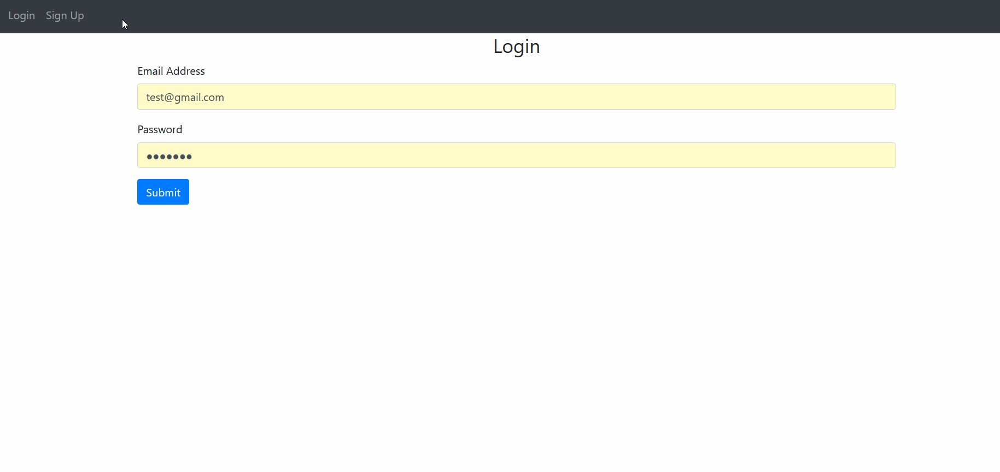
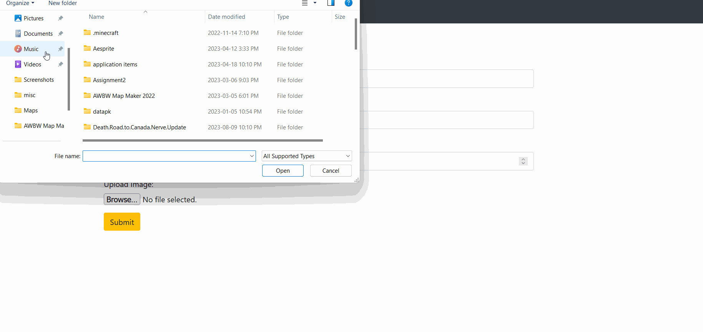
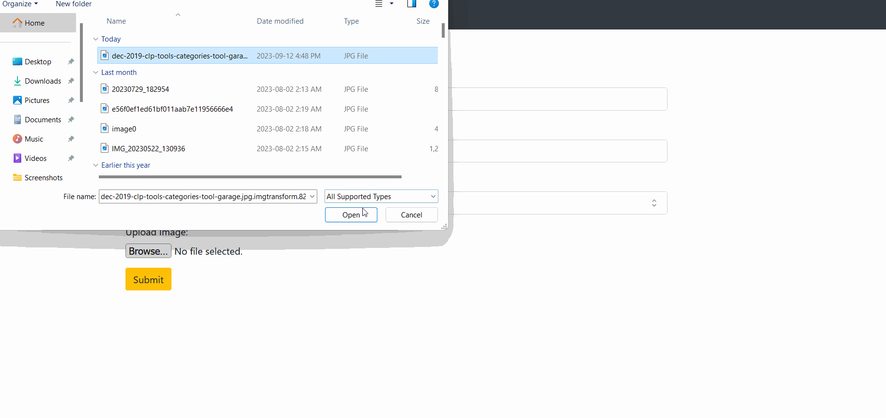

# Inventory Manager
A Flask app that stores images and information on a SQL Database and displays it

## Screenshots

## Features
- User login system
- Store images and other data
- Edit stored information

## Technologies Used
- Flask
- Python
- HTML
- REST
- Jinja
- SQLite

## Contact
Created by [@JoshuaLuo](https://github.com/Joshua-z-Luo) - feel free to contact me at jla818@sfu.ca
